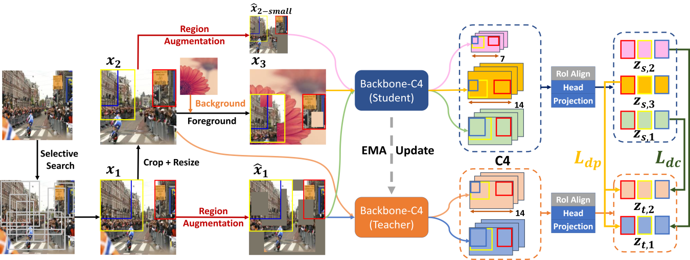

# D3SSL
[De-coupling and De-positioning Dense Self-supervised Learning](https://arxiv.org/abs/2303.16947)

By [Congpei Qiu](https://scholar.google.com.hk/citations?user=4zUPudAAAAAJ&hl=en) *, [Tong Zhang](https://sites.google.com/view/tong-zhang) *, [Wei Ke](https://gr.xjtu.edu.cn/web/wei.ke/homepage), [Mathieu Salzmann](https://people.epfl.ch/mathieu.salzmann), [Sabine Süsstrunk](https://scholar.google.com.hk/citations?user=EX3OYP4AAAAJ&hl=en&oi=ao).
> \* Equal contribution.

## Introduction

### Architecture

## OpenImage-MINI

## Main results

