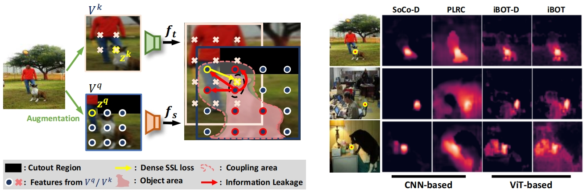

# Mind Your Augmentation: The Key to De-coupling Dense Self-supervised Learning

Released code and  pre-trained models for **ICLR 2024** paper **Mind Your Augmentation: The Key to De-coupling Dense Self-supervised Learning**. 

[[`paper`](https://openreview.net/forum?id=WQYHbr36Fo)] [[`project page`](https://congpeiqiu.github.io/Mind/)]

<div align="center">
  
</div>

The work presents a thorough investigation of the impact of coupling shortcuts in dense self-supervised learning. We propose a de-coupling strategy to integrate with the existing dense self-supervised learning methods to mitigate the negative impact of the coupling shortcuts, which consistently improves the performance of dense-level evaluation tasks.

#### Acknowledgement: Our project is built using the [iBOT](https://github.com/bytedance/ibot) repository.


## News 
- June 2024—Release the iBOT-based pre-trained models and code.
### Todo
- [ ] Release the code and pre-trained models for other pre-training methods.

## Installation

See [installation structions](https://github.com/bytedance/ibot/blob/main/INSTALL.md) for details. You also need to install [Kornia](https://kornia.github.io/) for data augmentation:
```
pip install kornia==0.6.9
```

## Data Preparation

We perform pre-training on [MS-COCO](https://cocodataset.org/#home) and dense-level evaluation on MS-COCO and [ADE20K](https://groups.csail.mit.edu/vision/datasets/ADE20K/). Please download the datasets from their official websites and organize the data as follows:
```
 ── your project path/
    └── data/
        └── ade
        │   ├── ADEChallengeData2016/
        │   │   ├── annotations/
        │   │   ├── images/
        └── coco
            ├── annotations/
            ├── train2017/
            └── val2017/
```


## Pre-training

### iBOT Pre-Training with ViTs

We use an 8-GPU machine with RTX 3090 GPUs to pre-train the models. To pre-train a ViT-S/16 model on MS-COCO with DDP, you can directly run the [script](configs/Pretrain.sh) as follows:
```
bash configs/Pretrain.sh
```
The parameter ```--dc``` is used to enable the de-coupling strategy. You can remove it to pre-train the model with the vanilla setting.
## Pre-Trained Models

The pre-trained models are available for download.```DC``` denotes the de-coupling strategy.
<table>
  <tr>
    <th>Model</th>
    <th>Arch.</th>
    <th>DC</th>
    <th>COCO Det.</th>
    <th>COCO ISeg.</th>
    <th>ADE20K Seg.</th>
    <th>Checkpoint</th>
  </tr>
  <tr>
    <td>iBOT</td>
    <td>ViT-S/16</td>
    <td> × </td>
    <td>42.3</td>
    <td>37.0</td>
    <td>39.9</td>
    <td><a href="https://drive.google.com/file/d/1_jXYqmq_HUf7ypD4R0TN8MsFw1E5TVVK/view?usp=drive_link">ckpt</a></td>
  </tr>
  <tr>
    <td>iBOT</td>
    <td>ViT-S/16</td>
    <td>√</td>
    <td>45.1</td>
    <td>39.1</td>
    <td>41.6</td>
    <td><a href="https://drive.google.com/file/d/1f2eJZwhHa07Ob1jEh9LoU_EYMvRVHTjL/view?usp=drive_link">ckpt</a></td>
  </tr>
</table>

## Downstream Evaluation

The evaluation protocol is consistent with [iBOT](https://github.com/bytedance/ibot/). 
You can refer to [Evaluating iBOT on Downstream Tasks](https://github.com/bytedance/ibot/blob/main/evaluation/README.md) for details. Or you can directly run the [script](configs/Evaluation.sh) to perform dense-level evaluation on MS-COCO and ADE20K.

## License
This repository is released under the Apache 2.0 license as found in the [LICENSE](LICENSE) file.

## Citation
If you find this repository useful, please consider giving a star :star: and citation:
```
@inproceedings{
qiu2024mind,
title={Mind Your Augmentation: The Key to Decoupling Dense Self-Supervised Learning},
author={Congpei Qiu and Tong Zhang and Yanhao Wu and Wei Ke and Mathieu Salzmann and Sabine S{\"u}sstrunk},
booktitle={The Twelfth International Conference on Learning Representations},
year={2024},
url={https://openreview.net/forum?id=WQYHbr36Fo}
}
```
